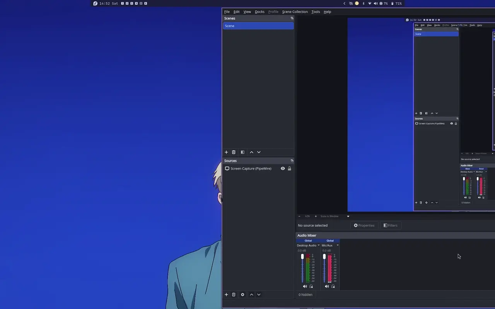

# Dotfiles

Dark, tiling-WM setups for Linux — currently covering both **Hyprland** (Catppuccin-themed, Lua config) and **Sway** (Gruvbox-themed), plus shared Waybar config.

<div align="center">
  
</div>

## Included

- **Hyprland** — window manager config written in Lua (`hyprland.lua`), lock screen (`hyprlock.conf`), idle behavior (`hypridle.conf`), wallpaper daemon (`hyprpaper.conf`), plus helper scripts (`scripts/`)
- **Sway** — window manager config (`config`) with Gruvbox theming, AZERTY keyboard layout, swayidle/swaylock, and swaybg wallpaper handling
- **Waybar** — status bar config and styling, with a custom Wi-Fi menu script (shared between Hyprland and Sway)

Both WM configs are maintained in parallel — copy over whichever you're running.

## Prerequisites

**For Hyprland:**
- [Hyprland](https://hyprland.org) (with Lua config support — see the [Hyprland Lua wiki page](https://wiki.hypr.land/Configuring/Start/))
- [hyprlock](https://github.com/hyprwm/hyprlock), [hypridle](https://github.com/hyprwm/hypridle), [hyprpaper](https://github.com/hyprwm/hyprpaper)

**For Sway:**
- [Sway](https://swaywm.org)
- `swaylock`, `swayidle`, `swaybg`
- `wofi` (app launcher)

**Shared:**
- [Waybar](https://github.com/Alexays/Waybar)
- A [Nerd Font](https://www.nerdfonts.com/) for icons in Waybar
- `grim`, `slurp`, `wl-copy` for screenshot keybinds
- `playerctl`, `brightnessctl`, `wpctl` for media/brightness/volume keybinds

## Usage

1. Clone the repo:
```bash
   git clone https://github.com/ilyas-bkgo/dotfiles.git ~/dotfiles
   cd ~/dotfiles
```

2. Back up anything you already have, then copy over the config(s) you want:

   **Hyprland:**
```bash
   mkdir -p ~/.config/hypr
   cp -r current-config/hypr/. ~/.config/hypr/
```

   **Sway:**
```bash
   mkdir -p ~/.config/sway
   cp current-config/sway/config ~/.config/sway/config
```

   **Waybar (used by both):**
```bash
   mkdir -p ~/.config/waybar
   cp -r current-config/waybar/. ~/.config/waybar/
   chmod +x ~/.config/waybar/scripts/wifi-menu.sh
```

3. Restart Hyprland/Sway (or reload configs) for changes to take effect.

## Notes

- Configs are copied, not symlinked — edits to files in `~/.config/` won't sync back to this repo. Pull changes from here again if you update the repo.
- `SUPER + W` launches a personal tool (`walt`) that isn't included in this repo. Remove or replace that keybind in `hyprland.lua` if you don't have it.
- The Sway config has some paths hardcoded to my username/wallpaper folder (e.g. `/home/urahara/Desktop/Wallpapers/main_wallpapers/`). Update `set $lock` and the `swaybg`/wallpaper-shuffle lines in `current-config/sway/config` to match your own paths before using it.
- This repo reflects my current setup and will evolve over time. Use at your own risk, review before running on a machine with configs you care about.

## License

MIT